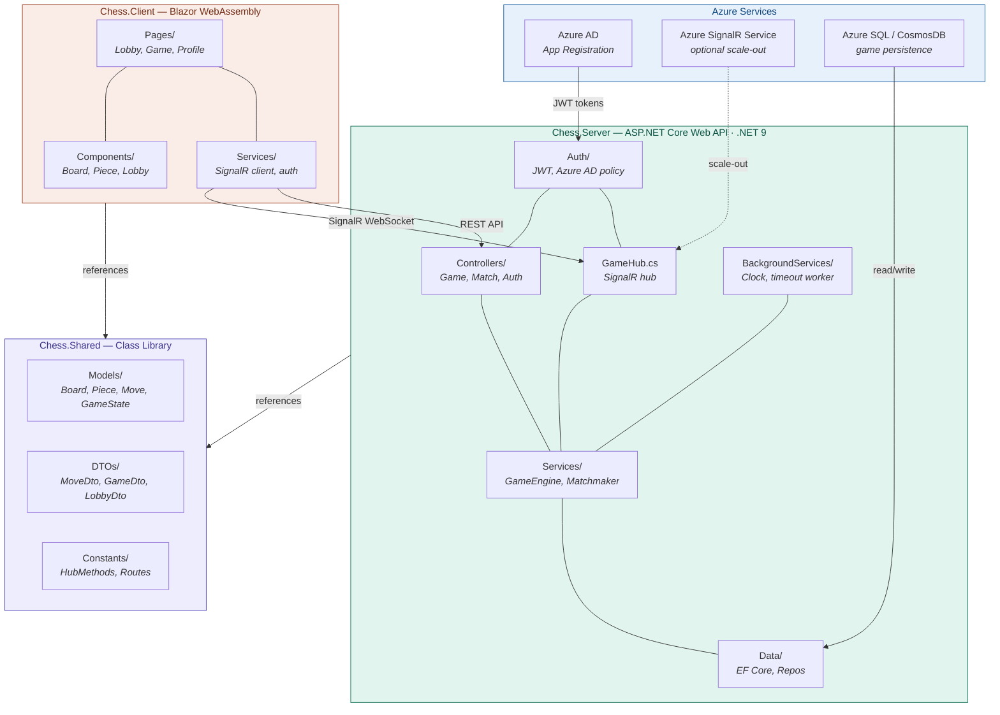

# KooxiChess

> Real-time two-player chess — Blazor WebAssembly + ASP.NET Core + SignalR + Azure AD


---

## Overview

KooxiChess is a full-stack, real-time chess application. Two authenticated players connect via SignalR, make moves that are validated server-side, and see the board update instantly. The server is authoritative for both move legality and game clocks.

---

## Solution Structure

| Project | Type | Role |
|---|---|---|
| `Chess.Shared` | Class Library (.NET 9) | Domain models, DTOs, and shared constants |
| `Chess.Server` | ASP.NET Core Web API (.NET 9) | Game logic, SignalR hub, auth, persistence |
| `Chess.Client` | Blazor WebAssembly (.NET 9) | Board UI, MSAL login, SignalR client |

```
Chess.sln
├── Chess.Shared/
│   ├── Enums/             PieceType, PieceColor, GameStatus, MoveType
│   ├── Models/            Square, Piece, Move, Board, GameState, Player
│   ├── DTOs/              MoveDto, GameDto, MoveResultDto, LobbyDto, PlayerDto
│   └── Constants/         HubMethods, ApiRoutes
│
├── Chess.Server/
│   ├── Hubs/              GameHub (SignalR)
│   ├── Controllers/       Game, Lobby, Auth endpoints
│   ├── Services/          GameEngine, Matchmaker, MoveValidator
│   ├── Data/              EF Core DbContext, repositories
│   ├── Auth/              Azure AD JWT configuration
│   └── BackgroundServices/ Clock ticker, timeout worker
│
└── Chess.Client/
    ├── Components/        Board, Piece, Lobby, Clock UI
    ├── Services/          SignalR client wrapper, auth service
    ├── Pages/             Lobby, Game, Profile pages
    └── wwwroot/           Static assets (CSS, images)
```

---

## Architecture



---

## Key Design Decisions

| Decision | Rationale |
|---|---|
| FEN strings for board state | Compact, standard, and easy to debug |
| Server-side move validation | Clients send `{from, to}` only — never trusted |
| Shared DTOs in `Chess.Shared` | Prevents client/server SignalR message mismatches |
| SignalR groups per game | Both players and spectators receive the same broadcasts |
| Authoritative server clock | Clients display interpolated time; server decides timeouts |

---

## Azure Integration

| Service | How It's Used |
|---|---|
| **Azure App Registration** | Defines a `chess/game.play` scope; API uses `ValidAudience`, client uses `DefaultScopes` |
| **Azure SignalR Service** | Swap in via `AddAzureSignalR()` in `Program.cs` for production scale-out (optional in dev) |
| **Azure SQL / CosmosDB** | Connected via EF Core for game history and user profiles |

---

## Development Phases

### Phase 1 — Foundation ✅ Complete

> Build `Chess.Shared` first — the hub, API, and UI all depend on these types.

**Chess.Shared — 16 files**

- **Enums** — `PieceType`, `PieceColor`, `GameStatus` (9 states: waiting → checkmate/timeout), `MoveType` (normal, capture, castling, en passant, promotion)

- **Models**
  - `Square` — algebraic notation parsing (`"e4"` ↔ file/rank)
  - `Piece` — FEN character export
  - `Board` — 8×8 grid, FEN serialization (both directions), `Clone()` for move simulation
  - `Move` — full metadata (notation, timestamps, move number, captured piece)
  - `Player` — Azure AD identity (UserId, DisplayName, ConnectionId)
  - `GameState` — root aggregate: board + active color + castling rights + en passant + clocks + move history + full FEN export

- **DTOs**
  - `MoveDto` — slim client→server payload (from, to, optional promotion)
  - `MoveResultDto` — server→client broadcast (notation, new FEN, check/checkmate flags)
  - `GameDto` — full state sync broadcast
  - `PlayerDto`, `LobbyGameDto`, `CreateGameDto`

- **Constants** — `HubMethods` (every SignalR method name as a typed constant, no magic strings), `ApiRoutes`

`Chess.Server` and `Chess.Client` `.csproj` files are wired up with project references to `Chess.Shared` and all required NuGet packages — ready for Phase 2.

---

### Phase 2 — Server + SignalR Hub

> Goal: a working move lifecycle with no UI.

- Stand up `Chess.Server` with `GameHub`, Azure AD auth, and an in-memory game store
- At the end of this phase, the full move cycle (join → move → broadcast → validate) can be tested with a SignalR test client

---

### Phase 3 — Client + Board UI

> Goal: a playable game in the browser.

- Wire up Blazor WebAssembly with MSAL login and SignalR connection
- Render the board, handle drag-and-drop piece movement
- Relay moves through the hub and update the board on broadcast

---

### Phase 4 — Polish

- Matchmaking lobby and waiting room
- Move clocks with server-authoritative timeouts
- Game history persistence to Azure SQL
- Azure SignalR Service scale-out
- Spectator mode

---

## Prerequisites

- [.NET 9 SDK](https://dotnet.microsoft.com/download/dotnet/9.0)
- Visual Studio 2022 or later
- Azure App Registration (for authentication)
- SQL Server or Azure SQL (for persistence)
- Azure SignalR Service *(optional — production scale-out only)*

---

## Getting Started

```bash
# 1. Clone and open the solution
git clone <repo-url>
# Open Chess.sln in Visual Studio

# 2. Configure Azure AD
# Edit Chess.Server/appsettings.json — set TenantId, ClientId, Audience

# 3. Run
# Set Chess.Server as startup project and press F5
# Blazor WASM client is served by the ASP.NET host
```
